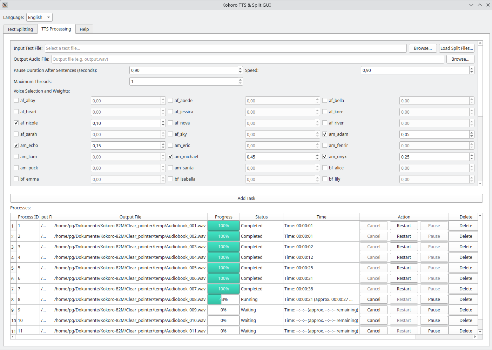
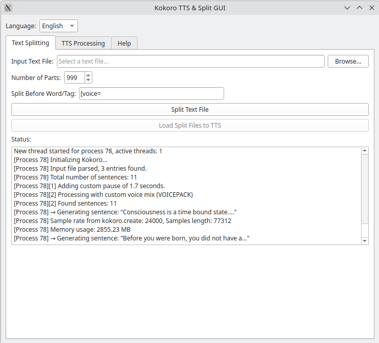

# Kokoro TTS GUI

A graphical user interface (GUI) for text-to-speech (TTS) processing and text file splitting using the Kokoro ONNX model. This tool allows users to split large text files into smaller parts and convert them to audio with customizable voice mixes, pause durations after each sentence, and reading speed.
Additional control characters such as flexible pause times and different voices can be used within the text (see TTS Processing below).

## Features
- **Text Splitting**: Split large text files into multiple parts based on a specified word or tag (e.g.,`Chapter`, `[voice=custom_mix]`).
- **TTS Processing**: Convert text files to WAV audio files using the Kokoro ONNX model with configurable voices, pauses, and speeds.
- **Multithreading**: Process multiple TTS tasks concurrently with adjustable thread limits.
- **Multilingual Support**: Switch between English and German interfaces.
- **Configuration Management**: Save and load settings for quick reuse.
- **Help Documentation**: Built-in help tab with usage instructions.

## Screenshots


## Requirements
- **Python**: Version 3.9–3.12
- **Dependencies**:
  ```bash
  pip install PyQt5 numpy torch soundfile psutil kokoro-onnx phonemizer-fork
  ```
- **Kokoro Model Files**:
  - `kokoro.onnx`
  - `voices-v1.0.bin`
  *(Note: These files are not included in the repository, they must be in the same folder as the gui)*

## Installation
1. Clone the repository:
   ```bash
   git clone https://github.com/Patrick-Ric/kokoro-tts-gui.git
   cd kokoro-tts-gui
   ```
2. Install dependencies:
   ```bash
   pip install -r requirements.txt
   ```
3. Place `kokoro.onnx` and `voices-v1.0.bin` in the project directory.
4. Run the application:
   ```bash
   python kokoro_tts_gui.py
   ```

## Usage
1. **Text Splitting**:
   - Go to the "Text Splitting" tab.
   - Select an input text file and specify the number of parts and a split word/tag (e.g., `[voice=custom_mix]`).
   - Click "Split Text File" to create split files.
   - Use "Load Split Files to TTS" to transfer them to the TTS tab by selecting the first split part with the ending _001.txt. All split parts are then read in by the GUI und processing and the work is started immediately.
   - Note: For very long texts such as audio books, this offers the option of splitting a long document into many smaller ones, so that if an error is detected later in the text or audio, only this section of the text needs to be corrected and recalculated instead of the entire audio book. 

2. **TTS Processing**:
   - In the "TTS Processing" tab, select an input text file or load split files.
   - Specify an output WAV file, pause duration, speed, and voice weights.
   - Click "Add Task" to queue the task.
   - Monitor progress in the process table, where you can pause, cancel, restart, or delete tasks.
   - Note: Within the text file you can use control commands such as
    `[voice=custom_mix]`
    `[voice=af_heart]`
    `[pause=1.2]`
    always at the beginning and alone in a line. 
   - Voicemix is the mixed voice from the GUI (Voice Selection an Weights) and it       can be activated by the control commands `[voice=custom_mix]` in the textfile.

3. **Configuration**:
   - Save your settings with "Save Configuration" for reuse.
   - Load previous settings with "Load Configuration".

4. **Language**:
   - Switch between English and German using the dropdown at the top.


## License
This project is licensed under the MIT License. See the [LICENSE](LICENSE) file for details.

## Contact
For issues or questions, open an issue on GitHub.


